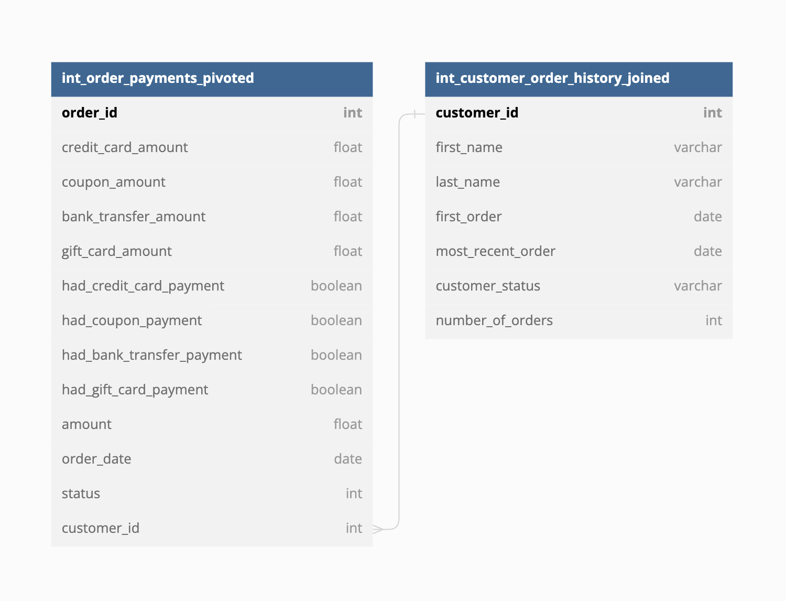

## Jaffle Shop Metrics 
In case you are unfamiliar with the jaffle_shop dataset and dbt example project, I highly recommend you first review this [repository](https://github.com/dbt-labs/jaffle_shop) to familiarize yourself with it. This project builds on top of it to demonstrate a simple example of a metrics implementation with dbt Metrics functionality.

#### **This repo has been updated to work with dbt v1.3**

### Differences From Jaffle Shop
There are a few differences in this example project when compared directly to 
jaffle_shop. They are:
- Restructuring the project based on the new guidance in [How we structure our projects](https://docs.getdbt.com/guides/best-practices/how-we-structure/1-guide-overview)
- Customers:
    - Removing the customer_lifetime_value field from customers. 
    - Adding a customer_status field to customers
- Orders:
    - Adding boolean flags for each payment method being present in order

## How To Add Metrics To Jaffle Shop
Now that we've gotten that information out of the way, lets add metrics to the 
jaffle shop dataset! First, lets look at the ERD of the dataset. This dataset shows 
the relationship between our two intermediate models, which we will later join into a 
single `mart` model for consumption.



Here we can see that our end-state data is based around two models:
- Orders: All information about our orders. 
- Customers: All information about customers

### The Prompt
Let's say that our Jaffle Shop is really **really** interested in the average 
order amount of our orders - we want to sell more Jaffles! Our CEO has reached
out to ask us to track average order amount but he wants to be able to see
it in the context of payment methods AND customer status. So lets build that out 
with the dbt Metric functionality!

### Materializing 
The CEO has requested this metric be able to see average order value by customer status,
which is a field that lives in the customers table. dbt does not currently support
join logic which means that we need to create an intermediate model combining orders 
and customers upon which we can build the metric. 

We accomplished this by creating the `orders` model, which serves 
to join `int_order_payments_pivoted` and `int_customer_order_history_joined` and materialize the output so that our metric can reference dimensions from both of them. For those curious about why we implemented this particular structure, please reference [How we structure our dbt projects](https://docs.getdbt.com/guides/best-practices/how-we-structure/1-guide-overview).

### Defining
Now that we've materialized the model that we'll use as the base for our metric, 
we need to define the metric we're interested in. Following the format defined 
in the documentation, we created the metric definition shown below:

```yaml
metrics:
  - name: average_order_amount
    label: Average Order Amount
    model: ref('orders')
    description: "The average size of a jaffle order"

    calculation_method: average
    expression: amount

    timestamp: order_date
    time_grains: [day, week, month]

    dimensions:
      - has_credit_card_payment
      - has_coupon_payment
      - has_bank_transfer_payment
      - has_gift_card_payment
      - customer_status
```

Now it's time to use metrics!

### Caveat Pre dbt-Server
Metrics are dynamic by nature and the ability to quickly iterate and
consume them is very important. The practice of materializing metric datasets
with pre-configured dimensions & time grains is considered an anti-pattern workaround to 
test & tire kick the functionality in mid 2022. This will change, however, with the release of 
dbt Server in late 2022. It will allow the user/consumer/BI tool to provide the 
parameters of the BI query and get returned the exact answer they are looking for,
as opposed to materializing each potential combination in tables.

### Consuming
To query the metric, we use the macros contained within the [`dbt_metrics` package](https://github.com/dbt-labs/dbt_metrics). For more information on all the parameters and options offered in the metrics macro, please reference the ReadME of the repository.

In the meantime, lets also begin to answer our CEO's question. If he were first interested in the weekly average order amount, we would enter the following query in which we:
- Define the metric being called
- Provide the grain that we are interested in
- Provide the list of dimensions we want to see

```sql
select * 
from {{ metrics.calculate(
    metric('average_order_amount'),
    grain='week',
    dimensions=[],
) }}
```

This returns a dataset where each row is equal to the average order amount metric 
for that particular week! I would then point my BI tool of choice at the materialized database 
object and visualize it for the CEO so his questions would be answered. 

If he wanted to see it within a different tool, we don't need to worry about differing
definitions across different methods of consumption - the definition is centralized
and so consistency is ensured across the company.

Lets go sell some Jaffles!

## Metrics At Scale
Jaffle shop aside, lets talk about what implementing metrics at scale would look like. The current implementation of dbt Metrics is largely inflexible from a consumers viewpoint - all the flexibility lives within the macro call and those who are unfamiliar/uncomfortable with dbt won't want to change the model. 

This doesn't mean that it isn't useful. The sheer act of defining and then materializing metric values within a single table, sans dimensions, can be incredibly powerful. 

For example, you could create a `metrics` folder/schema that only contains individual metric tables for reference by the entire company. This could be extremely helpful for high-level reporting across the business and allow consumers to interact in their tool of choice while the data remains consistent. As long as the model names where the metric macro is being called match the metric itself, there is reduced chance of consumer confusion. The entire organization can share a single view of what metrics are and build their understanding of the org around that.


## Resources:
- [What are dbt Metrics?](https://docs.getdbt.com/docs/building-a-dbt-project/metrics#about-metrics)
- [How do I create dbt Metrics?](https://docs.getdbt.com/docs/building-a-dbt-project/metrics#declaring-a-metric)
- [Ongoing Discussions around dbt Metrics](https://docs.getdbt.com/docs/building-a-dbt-project/metrics#ongoing-discussions)
